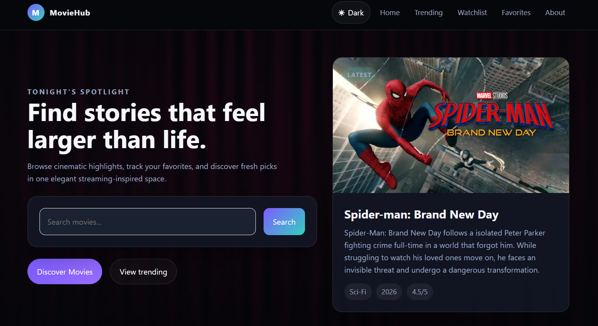
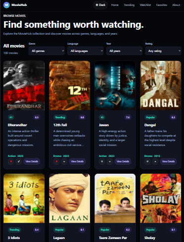
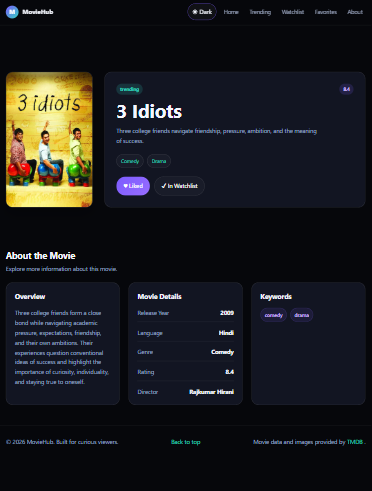
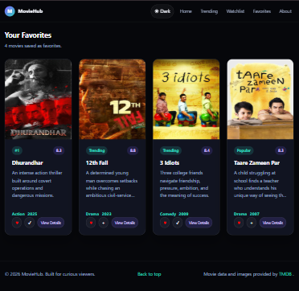

# 🎬 MovieHub

> A responsive movie discovery application built with HTML5, CSS3, and Vanilla JavaScript.

MovieHub is a modern movie discovery web application that allows users to explore movies, search for titles, view detailed movie information, add movies to their favourites, and maintain a personal watchlist.

The application uses the **TMDB API** to retrieve movie information and poster images and uses **Local Storage** to persist user preferences such as favourites and watchlist data.

---

## 🌐 Live Demo

🔗 **Live Website:**  
https://naman-gudhka.github.io/MovieHub---Movie-Discovery-App/

---

## 📸 Project Preview

### 🏠 Home Page



---

### 🔎 Browse Movies



---

### 🎬 Movie Details



---

### ❤️ Favourite Movies


---

### 📺 Watchlist



> 📌 Place your screenshots inside `assets/images/` and update the filenames above if necessary.

---

# 📖 About the Project

MovieHub is a frontend movie discovery platform created to provide users with a simple and enjoyable way to explore movies.

The application retrieves movie-related information and poster images from the **TMDB API** and dynamically displays the content using JavaScript.

Users can search for movies, explore movie details, save movies to favourites, and create a personal watchlist.

The project also uses browser Local Storage so that saved favourites and watchlist items remain available even after refreshing the page.

---

# 🎯 Purpose of the Project

The primary purpose of MovieHub is to build a practical frontend application while strengthening my understanding of JavaScript and modern web development concepts.

The project was developed to practice:

- API integration
- Dynamic web pages
- JavaScript modules
- DOM manipulation
- Event handling
- Local Storage
- Responsive design
- Search functionality
- URL parameters
- State management
- Reusable JavaScript functions
- Git and GitHub workflow

Rather than creating only a static website, MovieHub focuses on building an interactive application where the interface responds dynamically to user actions and external API data.

---

# ✨ Features

## 🎥 Movie Discovery

- Discover movies through a dynamic interface
- Display movie posters
- Display movie information
- Browse different movie sections
- Navigate between movie pages

## 🔎 Movie Search

- Search movies by title
- Display search results dynamically
- Navigate from search results to movie details
- Handle user search input

## 📄 Movie Details

- Dedicated movie details page
- Display movie poster
- Display movie information
- Access individual movie information through URL parameters

## ❤️ Favourites

- Add movies to favourites
- Remove movies from favourites
- View all favourite movies
- Persist favourites using Local Storage

## 📺 Watchlist

- Add movies to watchlist
- Remove movies from watchlist
- View saved watchlist movies
- Persist watchlist using Local Storage

## 🌙 Theme Support

- Switch between available themes
- Store theme preference in Local Storage
- Apply the selected theme across the application

## 📱 Responsive Design

MovieHub is designed to work across:

- 📱 Mobile devices
- 📱 Tablets
- 💻 Laptops
- 🖥️ Desktop screens

Responsive layouts are created using CSS media queries, Flexbox, and CSS Grid.

---

# 🛠️ Technologies Used

## Frontend

- HTML5
- CSS3
- Vanilla JavaScript

## Browser APIs

- Local Storage API
- DOM API
- Fetch API

## External API

- TMDB API

## Development Tools

- Visual Studio Code
- Live Server
- Git
- GitHub

---

# 🗂️ Project Structure

```text
MovieHub/
│
├── assets/
│   │
│   ├── css/
│   │   ├── base.css
│   │   ├── components.css
│   │   ├── layout.css
│   │   ├── responsive.css
│   │   └── style.css
│   │
│   ├── data/
│   │   ├── movies.js
│   │   └── user.js
│   │
│   ├── images/
│   │   ├── moviehub-home.png
│   │   ├── moviehub-browse.png
│   │   ├── moviehub-details.png
│   │   ├── moviehub-favourites.png
│   │   ├── moviehub-watchlist.png
│   │   └── ...
│   │
│   └── js/
│       ├── browse.js
│       ├── details.js
│       ├── favourites.js
│       ├── main.js
│       ├── movies.js
│       ├── navigation.js
│       ├── search.js
│       ├── theme.js
│       └── watchlist.js
│
├── about.html
├── browse.html
├── details.html
├── favorites.html
├── index.html
├── watchlist.html
│
├── update-posters.mjs
├── .gitignore
└── README.md